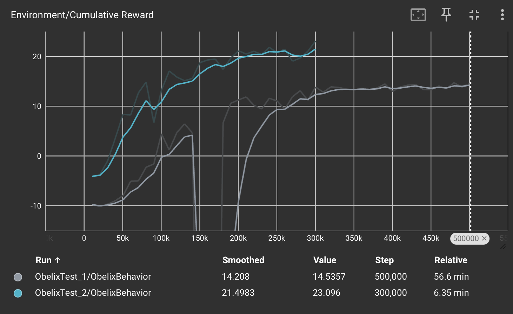
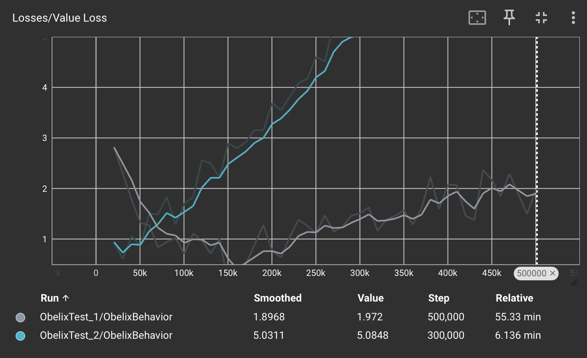

# Rapport: Optimalisatie van een Autonome Agent voor Materiaalverplaatsing

**Ondertitel:** Onderzoeksrapport ML-Agents Usecase "Obelix de menhirhouwer"  
**Datum:** 15 maart 2026  
**Onderwerp:** Reinforcement Learning binnen Unity

---

## 1. Inleiding

Dit rapport heeft tot doel de trainingsresultaten van een autonome agent (Obelix) te documenteren en te evalueren. In de gesimuleerde omgeving is het de bedoeling dat de agent menhirs lokaliseert en naar aangewezen bestemmingen transporteert. Dit onderzoek wordt uitgevoerd om inzicht te krijgen in de balans tussen positieve stimulansen en negatieve beloningen (rewards) binnen een complexe navigatietaak. Het rapport is bedoeld voor technische evaluatie en verdere optimalisatie van het leeralgoritme.

## 2. Methoden

Voor dit experiment is gebruikgemaakt van de Unity ML-Agents Toolkit (versie 2.0+). De agent is geconfigureerd met de volgende componenten:
* **Algoritme:** Proximal Policy Optimization (PPO).
* **Sensoren:** Een *Ray Perception Sensor 3D* met detectie-tags voor `Menhir` en `Destination`. Het bereik is afgestemd op de afmetingen van het speelveld om interferentie te voorkomen.
* **Actieruimte:** Continue acties voor translatie (voorwaarts/achterwaarts) en rotatie (Y-as).
* **Beloningsstructuur:** * Verplaatsing menhir naar bestemming: $+2.0$
    * Oppakken van een menhir: $+1.0$
    * Tijdstraf per stap: $-0.001$
    * Verlaten van het speelveld (vallen): $-10.0$

## 3. Resultaten

Tijdens de observatie van het getrainde model zijn de volgende resultaten vastgesteld:
* **Gedrag:** De agent slaagt erin menhirs te identificeren en op te pakken. Echter, bij navigatie nabij de randen van het platform vertoont de agent instabiel gedrag.
* **Incidentie:** Ondanks de significante strafwaarde van $-10.0$ voor het verlaten van het speelveld, komt het frequent voor dat de agent over de rand van het platform beweegt.
* **Snelheid:** De bewegingssnelheid van de agent tijdens de inferentiefase wordt als traag geobserveerd in vergelijking met de trainingsfase.
* **TensorBoard:** De *Cumulative Reward* curve vertoont een stijgende trend, maar heeft op het moment van stoppen nog geen stabiel plateau bereikt.

## 4. Conclusie

Het lijkt erop dat de huidige beloningsstructuur leidt tot een conflict in de beleidsvorming van de agent. De disbalans tussen de hoge straf voor vallen ($-10.0$) en de relatief lage beloning voor het voltooien van de taak ($+2.0$) kan ertoe leiden dat de agent een risicomijdende, en daardoor tragere, strategie aanneemt die de taakuitvoering belemmert. Het voortdurende "vallen" suggereert bovendien dat de agent onvoldoende visuele informatie heeft over de randen van het speelveld. 

Er wordt geconcludeerd dat extra trainingstijd en een herziening van de beloningsbalans noodzakelijk zijn om een betrouwbaar resultaat te behalen.

## 5. Referenties

* Unity Technologies (2024). *ML-Agents Toolkit Documentation*. Geraadpleegd via https://unity-ads.github.io/ml-agents/
* Vander Meulen, J. (2025). *Usecase: Obelix de menhirhouwer*. Cursusmateriaal Artificiële Intelligentie.

## Grafieken

